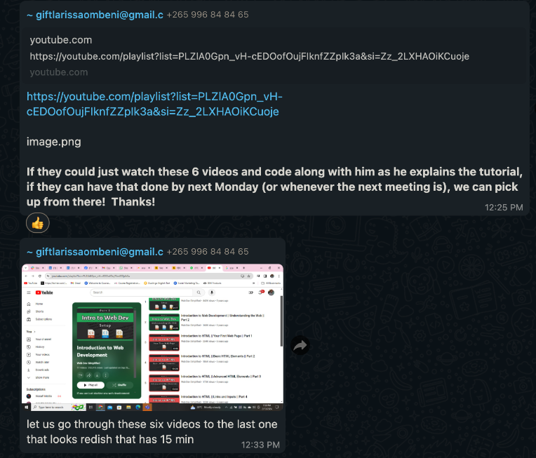
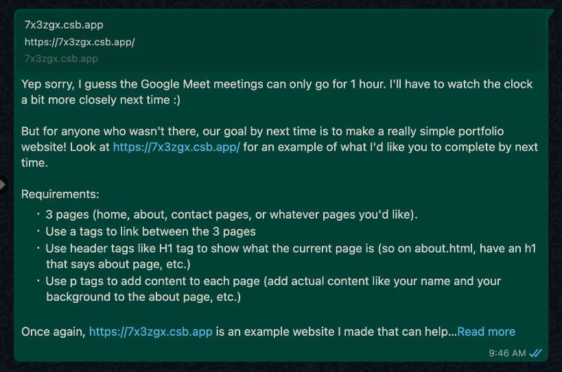
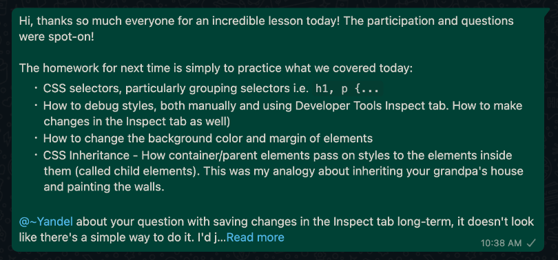
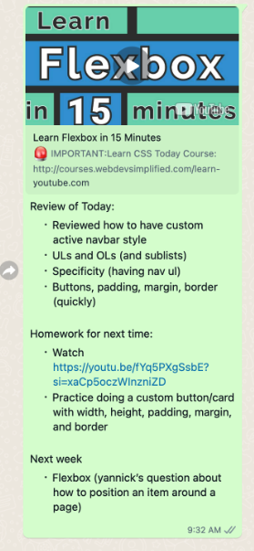

# zawadie

## 2/12/24

A simple intro into what is HTML, what is CSS, what is JavaScript. Showed how to get VS Code and open a project.

Homework for next time:

## 2/19/24

[https://7x3zgx.csb.app](https://7x3zgx.csb.app)

## 3/6/24

We went over CSS, tag vs. class vs. id selectors

## 3/12/24

[https://7x3zgx.csb.app](https://7x3zgx.csb.app)

## 3/19/24

### Demos and things to discuss

smith

- fix smith header text

- centered, background color

yannick

- logo in corner of navbar

- pictures (sizing)

jovial

- download cv button

- how to add a text shadow / border

kalala

- navbar active and inactive items

### Other topics covered

- Font-family
- Text-decoration: underline
- Flexbox intro
- Active links

## 3/26/24

Had to cancel lesson this week due to Shayla’s birthday and work deadlines.

Gave assignment to watch these 2 videos:

- [YouTube - CSS Box Model (Web Dev Simplified)](https://www.youtube.com/watch?v=rIO5326FgPE)

- [YouTube - Flexbox (Web Dev Simplified)](https://youtu.be/fYq5PXgSsbE?si=xaCp5oczWInzniZD)

## 4/2/24

Reviewed how to have custom active navbar style

ULs and OLs (and sublists)

Specificity (having `nav ul`)

Buttons, padding, margin, border (quickly)

Homework by next time:

- Watch [YouTube - Flexbox (Web Dev Simplified)](https://youtu.be/fYq5PXgSsbE?si=xaCp5oczWInzniZD)

- Practice doing a custom button/card with width, height, padding, margin, and border

## 4/9/24

Reviewed specificity (direct and indirect)

`nav ul` vs `nav > ul`

Reviewed doing custom cards with buttons, padding, margin, border

Showed vertical and horizontal scroll

Showed a teaser about flex (by showing horizontal scroll)

Homework by next time:

- Watch [YouTube - Flexbox (Web Dev Simplified)](https://youtu.be/fYq5PXgSsbE?si=xaCp5oczWInzniZD)

- Practice doing a custom button/card with width, height, padding, margin, and border

## 5/13/24

Today we reviewed classes vs. ids and when to use each one. We also talked about how to reference image `src`s and how to navigate between directories using to `./` for current directory and `../` for parent directory. We also talked about how to add animations such as a slide in from the top corner animation or scaling up animation.

## 5/20/24

We reviewed last week's material about classes vs. ids, referencing paths, then our top corner animation. We then built on what we did with the top corner animation by altering it so rather than just popping into the top left corner, having it animate to become the background of a whole section.

## 6/3/24

### Our discussion

We reviewed absolute positioning and z-index overlaps then jumped in discussing flex box and how to align elements side by side.

### Homework

> Okay here is the link to our code! https://github.com/brighamandersen/zawadie
>
> Make sure to open the link, then hit the green "Code" button then select "Download ZIP". That will let you get our project on your machine so you can edit it.
>
> Your homework is to add person cards or some like that which has the name for each agent, your position, and a picture of you. You can also add social media links as well! See you next time!

## 6/17/24

### Our discussion

We reviewed Smith Wilson's work on the contact card page and went over how you can use images that are in your project (`src="./...`) or on the web (`src="https://..."`).

We then discussed CSS breakpoints, how to apply different breakpoints on small devices and on large ones.

### Homework

Make contact cards if you haven't, then also change their size depending on your screen size.

## Next week

- Give time for them to demo their version of the site we've been building

## Long term roadmap

Git
JavaScript
